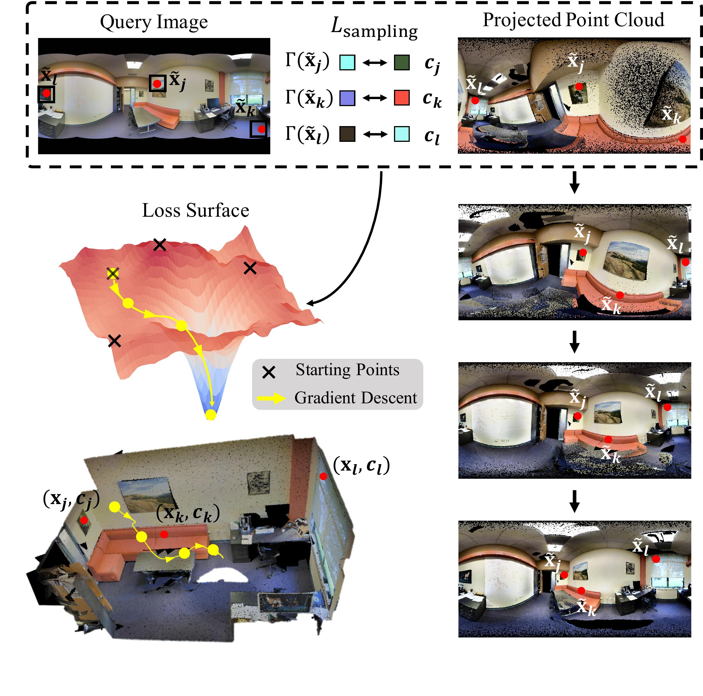
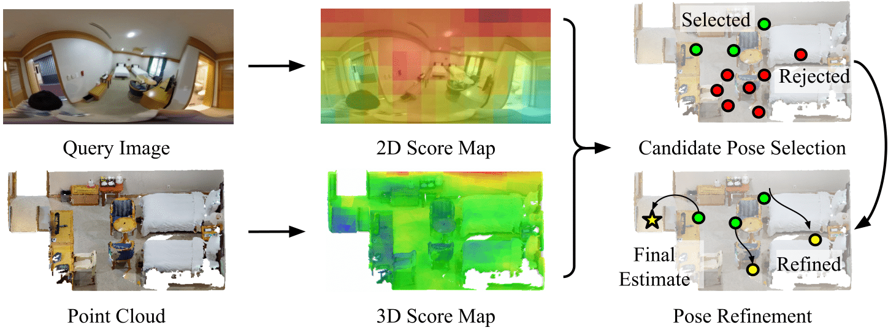
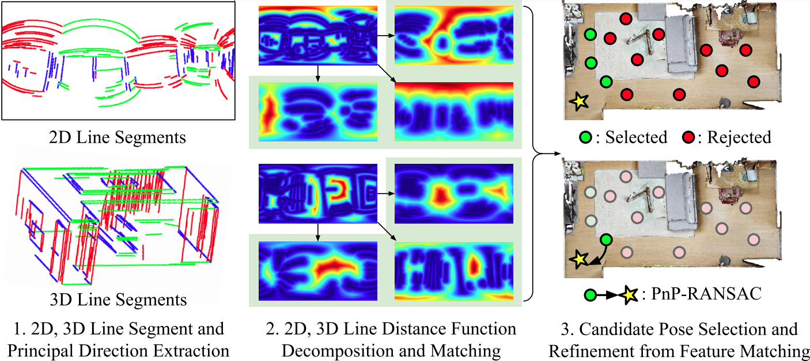
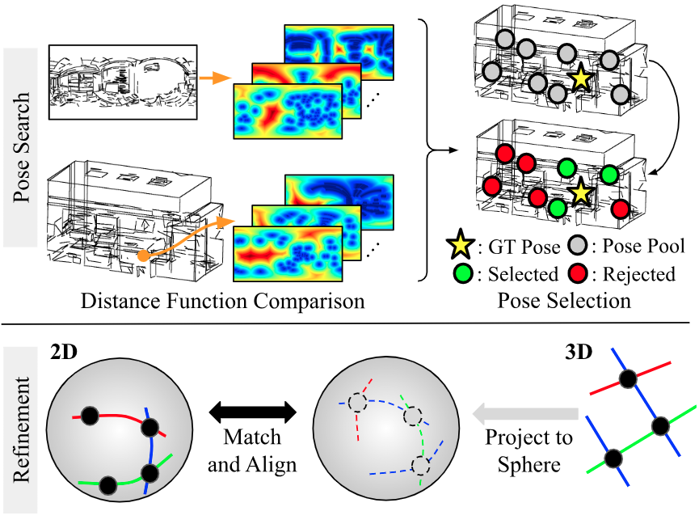

# Panoramic Localization
Panoramic localization library containing PyTorch implementations of various panoramic localization algorithms: [PICCOLO](https://openaccess.thecvf.com/content/ICCV2021/html/Kim_PICCOLO_Point_Cloud-Centric_Omnidirectional_Localization_ICCV_2021_paper.html) (ICCV 2021), [CPO](https://www.ecva.net/papers/eccv_2022/papers_ECCV/html/1567_ECCV_2022_paper.php) (ECCV 2022), [LDL](https://openaccess.thecvf.com/content/ICCV2023/html/Kim_LDL_Line_Distance_Functions_for_Panoramic_Localization_ICCV_2023_paper.html) (ICCV 2023), and [FGPL](https://www.junhokim.xyz/) (CVPR 2024).
Please refer to the links below to run each of the localization algorithms.

* PICCOLO: [Link](#running-piccolo) 
* CPO: [Link](#running-cpo)
* LDL: [Link](#running-ldl)
* FGPL: [Link](#running-fgpl)

## Description of Each Localization Algorithm
### PICCOLO (ICCV 2021)
[](piccolo_overview.jpg)\
PICCOLO is a panoramic localization algorithm that estimates camera pose given a set of input query image and colored point cloud.
The algorithm optimizes the discrepancy between the query image colors and the projected point cloud's color values.
For more details, please refer to the [original paper](https://openaccess.thecvf.com/content/ICCV2021/html/Kim_PICCOLO_Point_Cloud-Centric_Omnidirectional_Localization_ICCV_2021_paper.html) and [video](https://www.youtube.com/watch?v=E-_lEsChfoE).

### CPO (ECCV 2022)
[](cpo_overview.png)\
CPO is a follow-up work of PICCOLO that also estimated camera pose given a query image and point cloud.
Instead of directly optimizing the color values as in PICCOLO, CPO aims to match the color distributions, which lead to large amounts of runtime improvement.
For more details, please refer to the [original paper](https://www.ecva.net/papers/eccv_2022/papers_ECCV/papers/136690173.pdf) and [video](https://www.youtube.com/watch?v=V6XjHL5q0_Y).

### LDL (ICCV 2023)
[](ldl_overview.png)\
LDL is a line-based panoramic localization algorithm that localized a query image with respect to a 3D line map.
To this end, LDL compares the distribution of lines using line distance functions, which makes pose search even faster than CPO.
For more details, please refer to the [original paper](https://openaccess.thecvf.com/content/ICCV2023/papers/Kim_LDL_Line_Distance_Functions_for_Panoramic_Localization_ICCV_2023_paper.pdf) and [video](https://www.youtube.com/watch?v=cQ5l4rauNY0).

### FGPL (CVPR 2024)
[](fgpl_overview.png)\
FGPL is a line-based localization algorithm that finds the camera pose solely using the geometry of lines and their intersections.
The algorithm first performs coarse pose search using the spatial distribution of lines and their intersections, and then refines the poses by aligning the lines on the sphere.
For more details, please refer to the [original paper (to be updated)](https://www.junhokim.xyz/) and [video (to be updated)](https://www.junhokim.xyz/).

## Dataset preparation (Stanford 2D-3D-S & OmniScenes)
First ownload the panorama images (`pano`) and poses (`pose`) from the following [link](https://docs.google.com/forms/d/e/1FAIpQLScFR0U8WEUtb7tgjOhhnl31OrkEs73-Y8bQwPeXgebqVKNMpQ/viewform?c=0&w=1) (download the one without `XYZ`) and the point cloud (`pcd_not_aligned`) from the following [link](https://docs.google.com/forms/d/e/1FAIpQLScDimvNMCGhy_rmBA2gHfDu3naktRm6A8BPwAWWDv-Uhm6Shw/viewform?c=0&w=1).
Also, download the 3D line segments through the following [link](https://drive.google.com/file/d/1Ur67nN8Q2n_CXQxbI341TRUbQEmtEjuD/view?usp=sharing).
Then, place the data in the directory structure below.

    panoramic-localization/data
    └── stanford (Stanford2D-3D-S Dataset)
        ├── pano (panorama images)
        │   ├── area_1
        │   │  └── *.png
        │   ⋮
        │   │
        │   └── area_6
        │       └── *.png
        ├── pcd (point cloud data)
        │   ├── area_1
        │   │   └── *.txt
        │   ⋮
        │   │
        │   └── area_6
        │       └── *.txt
        ├── pcd_line (line cloud data)
        │   ├── area_1
        │   │   └── *.txt
        │   ⋮
        │   │
        │   └── area_6
        │       └── *.txt
        └── pose (json files containing ground truth camera pose)
            ├── area_1
            │   └── *.json
            ⋮
            │
            └── area_6
                └── *.json

To obtain results in OmniScenes, please refer to the download instructions [below](https://github.com/82magnolia/piccolo#downloading-omniscenes-update-new-scenes-added).
Note we are using the **old** version of OmniScenes for this repository.
In addition, download the 3D line segments through the following [link](https://drive.google.com/file/d/1M7A5iDXQdrPVUNmhKWRSFMQKit07jOK8/view?usp=sharing).
Then, place the data in the directory structure below.

    panoramic-localization/data
    └── omniscenes (OmniScenes Dataset)
        ├── change_handheld_pano (panorama images)
        │   ├── handheld_pyebaekRoom_1_scene_2 (scene folder)
        │   │  └── *.jpg
        │   ⋮
        │   │
        │   └── handheld_weddingHall_1_scene_2 (scene folder)
        │       └── *.jpg
        └── change_handheld_pose (json files containing ground truth camera pose)
        |   ├── handheld_pyebaekRoom_1_scene_2 (scene folder)
        |   │   └── *.json
        |   ⋮
        |   │
        |   └── handheld_pyebaekRoom_1_scene_2 (scene folder)
        |       └── *.json
        ⋮
        └── pcd_line (line cloud data)
        |   ├── pyebaekRoom_1lines.txt
        |   │
        |   ⋮
        |   │
        |   └── weddingHall_1lines.txt
        └── pcd (point cloud data)
            ├── pyebaekRoom_1.txt
            │
            ⋮
            │
            └── weddingHall_1.txt

## Installation
To run the codebase, you need [Anaconda](https://www.anaconda.com/). Once you have Anaconda installed, run the following command to create a conda environment.

    conda create --name omniloc python=3.7
    conda activate omniloc
    pip install -r requirements.txt -f https://download.pytorch.org/whl/torch_stable.html 
    conda install cudatoolkit=10.1

In addition, you must install pytorch_scatter. Follow the instructions provided in [the pytorch_scatter github repo](https://github.com/rusty1s/pytorch_scatter). You need to install the version for torch 1.7.0 and CUDA 10.1.

## Running PICCOLO
### Stanford 2D-3D-S or OmniScenes
Run the following command for Stanford 2D-3D-S.
```
python main.py --config config/stanford_piccolo.ini --log log/piccolo_test --method piccolo
```

Similarly, run the following command for OmniScenes
```
python main.py --config config/omniscenes_piccolo.ini --log log/piccolo_test --method piccolo
```

Note the sampling loss optimization can be done in parallel (with a slight sacrifice in localization accuracy), using the following command.
```
python main.py --config config/omniscenes_piccolo.ini --log log/piccolo_test --method piccolo --override 'refine_parallel=True'
```

### Preparing and Testing on Your Own Data
We also provide scripts for directly testing on your own data. 
First, prepare a query panorama image and 3D colored point cloud.
Then, run the following command, and the renderings at the localized pose will be saved in the log directory.
```
python main.py --config config/omniscenes_piccolo.ini --log LOG_DIRECTORY --method piccolo --single --query_img PATH_TO_QUERY_IMG --color_pcd PATH_TO_COLORED_POINT_CLOUD
```

## Running CPO
### Stanford 2D-3D-S or OmniScenes
Run the following command for Stanford 2D-3D-S.
```
python main.py --config config/stanford_cpo.ini --log log/cpo_test --method cpo
```

Similarly, run the following command for OmniScenes
```
python main.py --config config/omniscenes_cpo.ini --log log/cpo_test --method cpo
```

### Preparing and Testing on Your Own Data
We also provide scripts for directly testing on your own data. 
First, prepare a query panorama image and 3D colored point cloud.
Then, run the following command, and the renderings at the localized pose will be saved in the log directory.
```
python main.py --config config/omniscenes_cpo.ini --log LOG_DIRECTORY --method cpo --single --query_img PATH_TO_QUERY_IMG --color_pcd PATH_TO_COLORED_POINT_CLOUD
```

## Running LDL
### Stanford 2D-3D-S or OmniScenes
Run the following command for Stanford 2D-3D-S.
```
python main.py --config config/stanford_ldl.ini --log log/ldl_test --method ldl
```

Similarly, run the following command for OmniScenes
```
python main.py --config config/omniscenes_ldl.ini --log log/ldl_test --method ldl
```

### Preparing and Testing on Your Own Data
We also provide scripts for directly testing on your own data. 
First, prepare a query panorama image and 3D colored point cloud.
Then, extract 3D line segments using the [following repository](https://github.com/xiaohulugo/3DLineDetection).
Finally, run the following command, and the renderings at the localized pose will be saved in the log directory.
```
python main.py --config config/omniscenes_ldl.ini --log LOG_DIRECTORY --method ldl --single --query_img PATH_TO_QUERY_IMG --color_pcd PATH_TO_COLORED_POINT_CLOUD --line_pcd PATH_TO_LINE_CLOUD
```

## Running FGPL
### Stanford 2D-3D-S or OmniScenes
Run the following command for Stanford 2D-3D-S.
```
python main.py --config config/stanford_fgpl.ini --log log/fgpl_test --method fgpl
```

Similarly, run the following command for OmniScenes
```
python main.py --config config/omniscenes_fgpl.ini --log log/fgpl_test --method fgpl
```

While the default setup is large-scale localization with multiple line maps, one can also test sinlge room localization with the follwoing command:
```
python main.py --config config/omniscenes_fgpl.ini --log log/fgpl_test --method fgpl --override "loc_exp_mode=single_room"
```

### Preparing and Testing on Your Own Data
We also provide scripts for directly testing on your own data. 
First, prepare a query panorama image and 3D colored point cloud.
Then, extract 3D line segments using the [following repository](https://github.com/xiaohulugo/3DLineDetection).
Finally, run the following command, and the renderings at the localized pose will be saved in the log directory.
```
python main.py --config config/omniscenes_fgpl.ini --log LOG_DIRECTORY --method fgpl --single --query_img PATH_TO_QUERY_IMG --line_pcd PATH_TO_LINE_CLOUD
```

## Checking log files
Results from localization will be saved in `.pkl` files. To open a single `.pkl` file and print the recall at `0.1m, 5deg`, run the following command.
```
python process_logger.py log/result.pkl 0.1 5
```

We also provide scripts for viewing aggregated results from multiple log files within a directory.
Suppose one has multiple log files whose paths start with the prefix `./log/ldl_test/scene_`.
One can run the following command to view the aggregated recall at `0.1m, 5deg`.
```
python aggregate_logger.py ./log/ldl_test/scene_ 0.1 5
```

## Citation
If you find the repository useful, please cite the following papers:
```bibtex
@InProceedings{Kim_2021_ICCV,
    author    = {Kim, Junho and Choi, Changwoon and Jang, Hojun and Kim, Young Min},
    title     = {PICCOLO: Point Cloud-Centric Omnidirectional Localization},
    booktitle = {Proceedings of the IEEE/CVF International Conference on Computer Vision (ICCV)},
    month     = {October},
    year      = {2021},
    pages     = {3313-3323}
}
```

```bibtex
@InProceedings{Kim_2022_ECCV,
    author    = {Kim, Junho and Jang, Hojun and Choi, Changwoon and Kim, Young Min},
    title     = {CPO: Change Robust Panorama to Point Cloud Localization},
    booktitle = {Proceedings of the European Conference on Computer Vision (ECCV)},
    month     = {October},
    year      = {2022},
    pages     = {176-192},
}
```

```bibtex
@InProceedings{Kim_2023_ICCV,
    author    = {Kim, Junho and Choi, Changwoon and Jang, Hojun and Kim, Young Min},
    title     = {LDL: Line Distance Functions for Panoramic Localization},
    booktitle = {Proceedings of the IEEE/CVF International Conference on Computer Vision (ICCV)},
    month     = {October},
    year      = {2023},
    pages     = {17882-17892}
}
```

```bibtex
@InProceedings{Kim_2024_CVPR,
  author    = {Kim, Junho and Jeong, Jiwon and Kim, Young Min},
  title     = {Fully Geometric Panoramic Localization},
  booktitle = {Proceedings of the IEEE/CVF Conference on Computer Vision and Pattern Recognition (CVPR)},
  month     = {June},
  year      = {2024},  
}          
```
